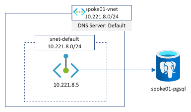

This article aims at describing a new Azure service that has just been published in public preview and which should be of a great help when dealing with complex and hybrid DNS scenarios: **Azure DNS Private resolver**

<section class="row">
  

  

    
  

  

</section>

To illustrate the service, we will start by describing the main components that already exist in the DNS ecosystem in Azure because several of this services will still be involved in an ideal target architecture. Then, we will start from a typical customer hybrid DNS architecture in Azure and we'll porogressively adapt it to use **Azure DNS Private resover** through various designs and options. The last part of this article will be devoted to show you how we can integrate Azure DNS Private resolver along with Azure Firewall to get some precious DNS insights.

// TOC

Main Azure DNS components
=========================

168.63.129.16
--------------

What is it? When dealing with DNS in Azure (but not only DNS), you will deal with this very special IP. From a DNS point of view, it can be seen as a server that will be able to resolve both public and private DNS names from sources located in Azure. For more information avout this virtual IP address, please read [What is IP address 168.63.129.16?](https://docs.microsoft.com/en-us/azure/virtual-network/what-is-ip-address-168-63-129-16)

When we let the default configuration on Vnet or on network interfaces as seen in the following screenshot, we are basically saying that all our DNS queries will be send to this public IP

<section class="row">
  

  

    
  

  

</section>

Azure Private DNS zone
----------------------

Extract from [What is a private Azure DNS zone?](https://docs.microsoft.com/en-us/azure/dns/private-dns-privatednszone)
> Azure Private DNS provides a reliable, secure DNS service to manage and resolve domain names in a virtual network without the need to add a custom DNS solution. By using private DNS zones, you can use your own custom domain names rather than the Azure-provided names available today.

These zones can be resolved as soon as the public IP described in the previous section is involved in the DNS reoslution: a private DNS zone can be linked to a virtual network. If this virtual network relies on **168.63.129.16** as its DNS server, then private records can be resolved for VMs running in this Vnet.

Azure Private endpoint
----------------------

Azure Private Link and Private endpoint is the solution to make PaaS service (deployed outside of customers network) private and to access it using customers private IP address. More information can be found [here](https://docs.microsoft.com/en-us/azure/private-link/private-endpoint-overview)

As this article is oriented around DNS, the usage of Private Link/Private service from this perspective can be a little bit tricky and especially whith hybrid architecture and DNS resolution from the on-premise world. If you are interested in understanding all the options available and pros/cons of each, we highly recommend you to read [this article from Daniel Mauser](https://github.com/dmauser/PrivateLink/tree/master/DNS-Integration-Scenarios#41-which-conditional-forwarder-zone-should-be-used)

Here is a representation of a private endpoint deployed in our own Vnet and pointing to a PostgreSQL PaaS database instance

<section class="row">
  

  

    
  

  

</section>

The most important part to understand when dealing with private endpoint and PaaS services is that whether we use a public or a private IP address, we **MUST** always access the service with its FQDN name (because SNI is involved for security purposes) and this is why there is always a point around private ednpoint and DNS.

A typical (but simplified) hybrid DNS architecture
==================================================

This schema show the kind of architecture many companies have in place

The main points to notice here are:
- we have the on-premise world which is interconnected with the Azure world and both have their dedicated DNS architecture
- Azure is made of a well-known hub and spoke architecture with DNS servers deployed in the hub
- we represented the on-premise DNS architecture with a load balancer and 2 VMs to illustrate the high availability aspect of the service. They can be of many sort (InfoBlox, Efficent IP, domain controllers)
- On-premise DNS servers
  - own a customer domain (or many): **contoso.internal** in our example
  - have conditional forwarder configured to send traffic into Azure IaaS DNS servers for several domains: Azure customer internal domain (**contoso.azure** here)
- Azure IaaS DNS servers
  - own the Azure customer internal domain (**contoso.azure** here)
  - have conditional forwarder for the main customer domain(s): **contoso.internal**
  - have a default forwarder for anything else that is pointing to the Azure magic IP address
- Azure hub Vnet
  - has a private DNS zone attached for the privatelink.postgres.database.azure.com domain (for Private Link / Private Endpoint resolution)
  - is configured to send all DNS queries to **10.221.2.4** which is the IP address of the Internal Load-balancer of the Azure IaaS DNS servers

Now that we detailed the architecture, let's see some examples of DNS resolution from different sources to some targets.

*onprem1.contoso.internal* resolution from *spoke1*
---------------------------------------------------

This example is straightforward:
- spoke1 send the query to the DNS ILB in the hub as defined in the DNS settings of the spoke01-vnet
- DNS VM send the request to the on-premise LB because of its conditional forwarder configuration
- on-premise DNS own the domain and cxan return the associated A record

*spoke1pgsingle.postgres.database.azure.com* resolution from *spoke1*
---------------------------------------------------------------------

2 things are important to understand in this example:
- DNS2 sends the query to **168.63.129.16** in step 3 because no conditional forwarder are defined in the DNS configuration that match the domain so the query is then send to the default forwarder
- The Azure DNS service is able to return the A record associated to spoke1pgsingle because
  1. The DNS IaaS VM are in the hub Vnet
  2. The private DNS zone for the postgres.database.azure.com is linked to this hub Vnet

*spoke1pgsingle.postgres.database.azure.com* resolution from *onprem1*
---------------------------------------------------------------------

This time, the resolution is a mixmatch of the two previous examples: conditional forwarder from on-premise to Azure for the private link DNS zone & private DNZ zone linked to the hub Vnet where IaaS DNS servers stand