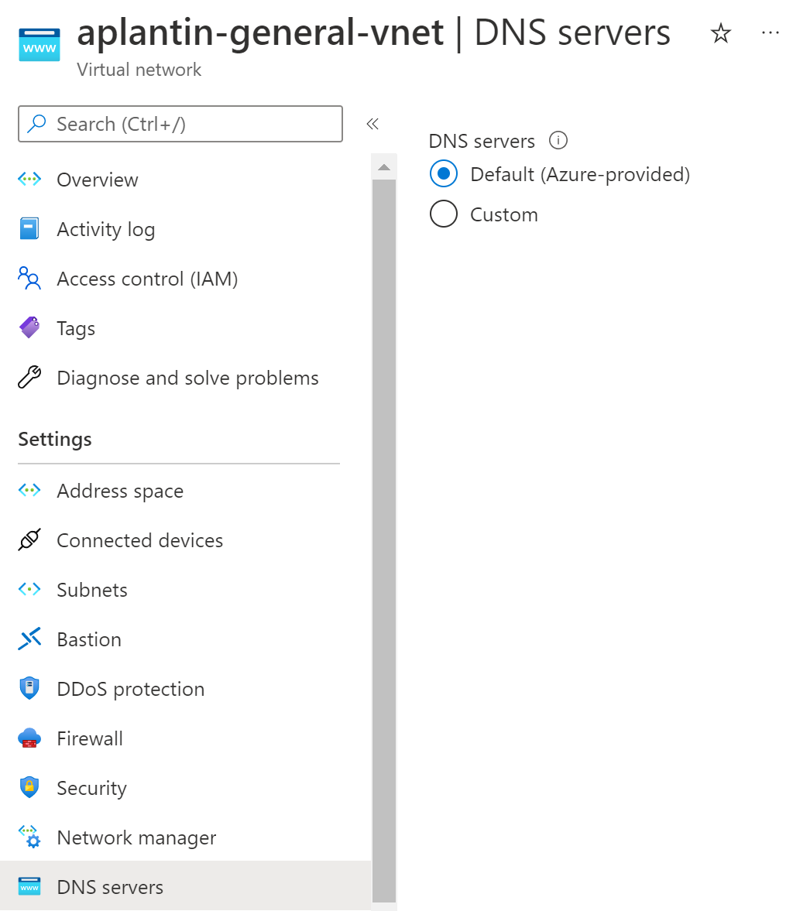
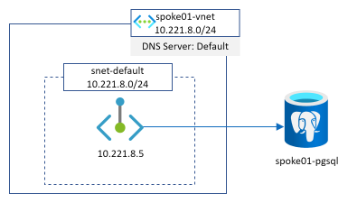
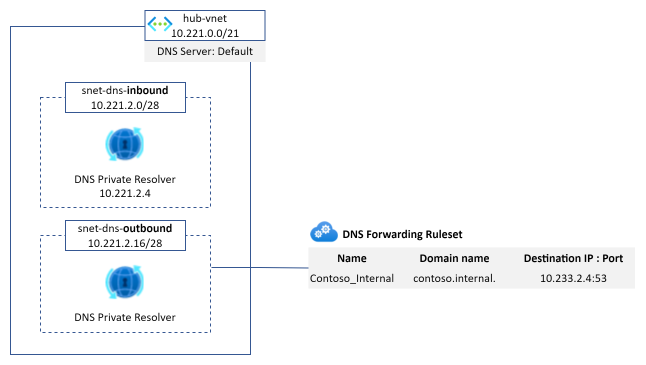

This article aims at describing an Azure service that should be of a great help when dealing with complex and hybrid DNS scenarios: **Azure DNS Private resolver**

<section class="row">
  

  

    
  

  

</section>

To illustrate the service, we will start by describing the main components that already exist in the DNS ecosystem in Azure because several of these services will still be involved in an ideal target architecture. Then, we will start from a typical customer hybrid DNS architecture in Azure and we'll progressively adapt it to use **Azure DNS Private resolver** through various designs and options.

- [Main Azure DNS components](#main-azure-dns-components)
  - [168.63.129.16](#1686312916)
  - [Azure Private DNS zone](#azure-private-dns-zone)
  - [Azure Private endpoint](#azure-private-endpoint)
- [A typical (but simplified) hybrid DNS architecture](#a-typical-but-simplified-hybrid-dns-architecture)
  - [*onprem1.contoso.internal* resolution from *spoke1*](#onprem1contosointernal-resolution-from-spoke1)
  - [*spoke1pgsingle.postgres.database.azure.com* resolution from *spoke1*](#spoke1pgsinglepostgresdatabaseazurecom-resolution-from-spoke1)
  - [*spoke1pgsingle.postgres.database.azure.com* resolution from *onprem1*](#spoke1pgsinglepostgresdatabaseazurecom-resolution-from-onprem1)
  - [Challenges](#challenges)
- [Azure DNS Private resolver](#azure-dns-private-resolver)
  - [*hub-vm.contoso.azure* resolution from *spoke1*](#hub-vmcontosoazure-resolution-from-spoke1)
  - [*spoke1pgsingle.postgres.database.azure.com* resolution from *spoke1*](#spoke1pgsinglepostgresdatabaseazurecom-resolution-from-spoke1-1)
  - [*spoke1pgsingle.postgres.database.azure.com* resolution from *onprem1*](#spoke1pgsinglepostgresdatabaseazurecom-resolution-from-onprem1-1)
- [Conclusion](#conclusion)
- [Links](#links)

Main Azure DNS components
=========================

168.63.129.16
--------------

What is it? When dealing with DNS in Azure (but not only DNS), you will deal with this very special IP. From a DNS point of view, it can be seen as a server that will be able to resolve both public and private DNS names from sources located in Azure. For more information about this virtual IP address, please read [What is IP address 168.63.129.16?](https://docs.microsoft.com/en-us/azure/virtual-network/what-is-ip-address-168-63-129-16)

When we let the default configuration on Vnet or on network interfaces as seen in the following screenshot, we are basically saying that all our DNS queries will be send to this public IP.

<section class="row">
  

  

    
  

  

</section>

Azure Private DNS zone
----------------------

Extract from [What is a private Azure DNS zone?](https://docs.microsoft.com/en-us/azure/dns/private-dns-privatednszone):
> Azure Private DNS provides a reliable, secure DNS service to manage and resolve domain names in a virtual network without the need to add a custom DNS solution. By using private DNS zones, you can use your own custom domain names rather than the Azure-provided names available today.

These zones can be resolved as soon as the public IP described in the previous section is involved in the DNS reoslution: a private DNS zone can be linked to a virtual network. If this virtual network relies on **168.63.129.16** as its DNS server, then private records can be resolved for VMs running in this Vnet.

Azure Private endpoint
----------------------

Azure Private Link and Private endpoint is the solution to make PaaS service (deployed outside of customers network) private and to access it using customers private IP address. More information can be found [here](https://docs.microsoft.com/en-us/azure/private-link/private-endpoint-overview).

As this article is oriented around DNS, the usage of Private Link/Private endpoint service from this perspective can be a little bit tricky and especially whith hybrid architecture and DNS resolution from the on-premise world. If you are interested in understanding all the options available and pros/cons of each, we highly recommend you to read [this article from Daniel Mauser](https://github.com/dmauser/PrivateLink/tree/master/DNS-Integration-Scenarios#41-which-conditional-forwarder-zone-should-be-used).

Here is a representation of a private endpoint deployed in our own Vnet and pointing to a PostgreSQL PaaS database instance:

<section class="row">
  

  

    
  

  

</section>

The most important part to understand when dealing with private endpoint and PaaS services is that whether we use a public or a private IP address, we **MUST** always access the service with its FQDN name (because TLS and SNI are involved for security purposes) and this is why there is always a point around private endpoint and DNS.

A typical (but simplified) hybrid DNS architecture
==================================================

This schema show the kind of architecture many companies have in place

The main points to notice here are:
- We have the on-premise world which is interconnected with the Azure world and both have their dedicated DNS architecture
- Azure is made of a well-known hub and spoke architecture with DNS servers deployed in the hub
- We represented the on-premise DNS architecture with a load balancer and 2 VMs to illustrate the high availability aspect of the service. They can be of many sort (InfoBlox, Efficent IP, domain controllers)
- On-premise DNS servers
  - own a customer domain (or many): **contoso.internal** in our example
  - have conditional forwarder configured to send traffic into Azure IaaS DNS servers for several domains: Azure customer internal domain (**contoso.azure** here)
- Azure IaaS DNS servers
  - own the Azure customer internal domain (**contoso.azure** here)
  - have conditional forwarder for the main customer domain(s): **contoso.internal**
  - have a default forwarder for anything else that is pointing to the Azure magic IP address
- Azure hub Vnet has a private DNS zone attached for the **privatelink.postgres.database.azure.com** domain (for Private Link / Private Endpoint resolution)
- All Azure Vnets are configured to send their DNS queries to **10.221.2.4** which is the IP address of the Internal Load-balancer of the Azure IaaS DNS servers

Now that we detailed the architecture, let's see some examples of DNS resolution from different sources to some targets.

*onprem1.contoso.internal* resolution from *spoke1*
---------------------------------------------------

This example is straightforward:
- spoke1 send the query to the DNS ILB in the hub as defined in the DNS settings of the spoke01-vnet
- DNS VM send the request to the on-premise LB because of its conditional forwarder configuration
- on-premise DNS is authoritative on the domain and returns the associated A record

*spoke1pgsingle.postgres.database.azure.com* resolution from *spoke1*
---------------------------------------------------------------------

2 things are important to understand in this example:
- DNS2 sends the query to **168.63.129.16** in step 3 because no conditional forwarder are defined in the DNS configuration that match the domain so the query is then sent to the default forwarder
- The Azure DNS service is able to return the A record associated to **spoke1pgsingle** because
  1. The DNS IaaS VM are in the hub Vnet
  2. The Azure Private DNS Zone for the **privatelink.postgres.database.azure.com** domain is linked to this hub Vnet

*spoke1pgsingle.postgres.database.azure.com* resolution from *onprem1*
---------------------------------------------------------------------

This time, the resolution is a combination of the two previous examples: 
- there is a conditional forwarder from on-premise to Azure for the private link DNS zone
- the Azure Private DNS Zone **privatelink.postgres.database.azure.com** is linked to the hub Vnet where IaaS DNS servers stand.

Challenges
----------

This architecture is actually working pretty well but, to be honest, it has some drawbacks:
- customer still have to deploy a IaaS based architecture in its Azure infrastructure to manage efficiently Azure related domains and to get benefit from Vnet Links for private DNS zones and enable private link resolution from on-premise
- these VMs lifecycle must still be managed (patching, upgrades, monitoring, backup...)
- the DNS solution they own must be configured somehow to manage A records but also to define conditional and default forwarders

Azure DNS Private resolver
==========================

Based on the challenges described above, Microsoft introduces a brand new managed service that elimite all this extrawork: Azure DNS Private resolver. It enables users to query Azure private DNS zones from on-premise environment and vice versa without deployed IaaS DNS servers. The service is fully managed by Microsoft and is highly available by nature. Moreover, it is really easy to deploy, to configure and to use.

The service comes with two kind of Azure resources:
- **DNS Private resolver:** the service reference one (and only one) Vnet and it needs two subnets (the recommended masks for the subnets are /28)
  - an inbound subnet to provision inbound endpoints
  - an outbound subnet to provision outbound endpoints
- **DNS Forwarding Ruleset**
  - as it name suggests, it is a collection of DNS forwarding rules (up to 1000)
  - it can be linked to one or more Vnets

<section class="row">
  

  

    
  

  

</section>

Once a DNS Forwarding Ruleset is attached to the Vnet, the way the resolution is working is very similar to the Azure private DNS zone workflow:
1. The VM send the DNS query to the configured DNS server (Azure-provided) which corresponds to the **168.63.129.16** ip address
2. The virtual DNS service looks if a forwarding rule associated to the requested domain exists
3. If it exists, it sends the query to the next hop ip address defined on the forwarding to pursue the resolution

Now, that we've presented the service and its components, we can imagine several design and implementation depending on our requirements.

As you can see in the schema, the IaaS DNS servers have gone and have been replaced by the DNS private resolver components. We then defined a Forwarding Ruleset attached to our hub Vnet with a forwarding rule to send all **contoso.internal** requests to **10.233.2.4:53** which is the internal IP of the on-premise DNS service. We also replaced the DNS settings of the Vnet to set the Azure-provided one.

An alternate design consists in relying on the Azure-provided DNS settings not only on the hub but also on the spoke Vnets. We then need to link the forwarding ruleset to the spokes. In a manner, this is a centralized vs decentralised approach. The following schema represents this alternative

As you probably notice, this architecture requires to have two different instances of the DNS Forwarding Ruleset because **contose.azure** and **privatelink.postgresql.database.azure.com** domain do not require forwarding rules to be resolved in the hub Vnet as they have their private DNS zones linked.

*hub-vm.contoso.azure* resolution from *spoke1*
---------------------------------------------------

The DNS query is sent to the DNS private resolver managed service instead of the DNS VMs. We have the resolution working from our private resolver because it is deployed in the hub Vnet that is linked to the **contoso.azure** private DNS zone.

*spoke1pgsingle.postgres.database.azure.com* resolution from *spoke1*
---------------------------------------------------------------------

This is quite the same as before except that the DNS query is sent to the DNS private resolver managed service. We have the resolution working from our private resolver because it is deployed in the hub Vnet that is linked to the **privatelink.postgres.database.azure.com** DNS zone.

*spoke1pgsingle.postgres.database.azure.com* resolution from *onprem1*
---------------------------------------------------------------------

Even for on-premise, we do not need IaaS DNS servers in the hub Vnet anymore to resolve privatelink or private DNS zone records. This become much much easier and faster for users to setup their hybrid DNS infrastructure.

Conclusion
==========

With this new DNS service, it is now straightforward to setup complex DNS architecture with several conditional forwarders between Azure and on-premise (and vice versa) and it becomes also easy to provide privatelink resolution capabilities from on-premise. As the usage of privatelink is becoming higher and higher, it was important for users to setup their DNS resolution is a simple way without having to manage on their own their old good VMs with DNS services. 

In a future article, we'll describe how we can integrate the Azure DNS Private resolver service with Azure Firewall in order to get precious insights about DNS queries in our Azure ecosystem.

Links
=====

A microhack to bootstrap a complete architecture similar to the one described in this article and to perform several resolution tests co-written with [David Santiago](https://www.linkedin.com/in/davsantiago/): [Microhack DNS private resolver](https://github.com/dawlysd/azure-dns-private-resolver-microhack)

[What is Azure DNS Private Resolver?](https://docs.microsoft.com/en-us/azure/dns/dns-private-resolver-overview)

[Create an Azure private DNS Resolver](https://docs.microsoft.com/en-us/azure/dns/dns-private-resolver-get-started-portal)