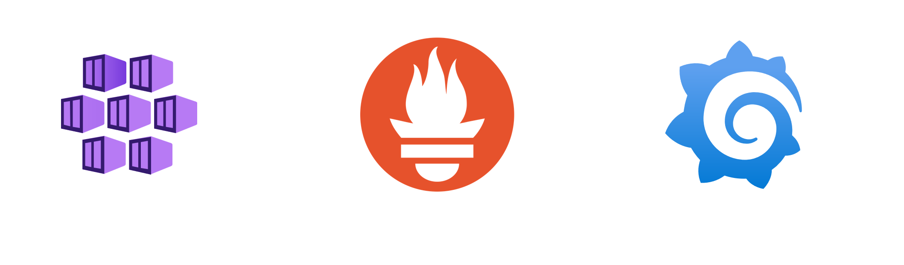
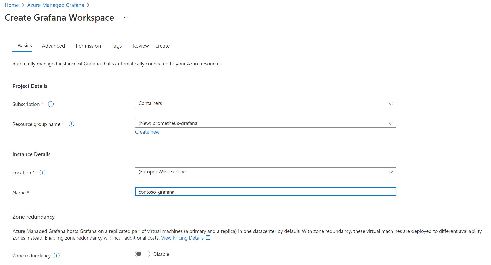
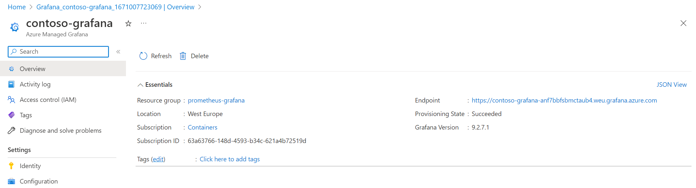
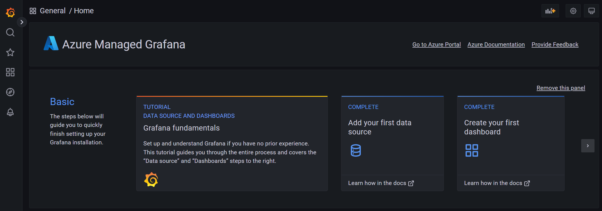
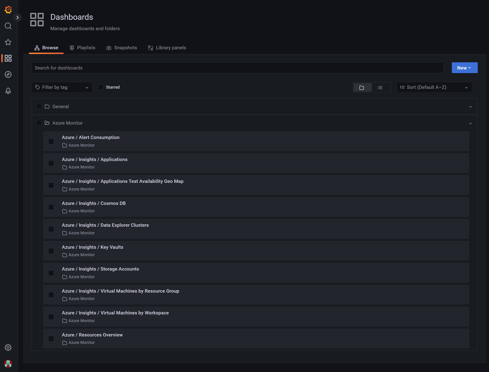
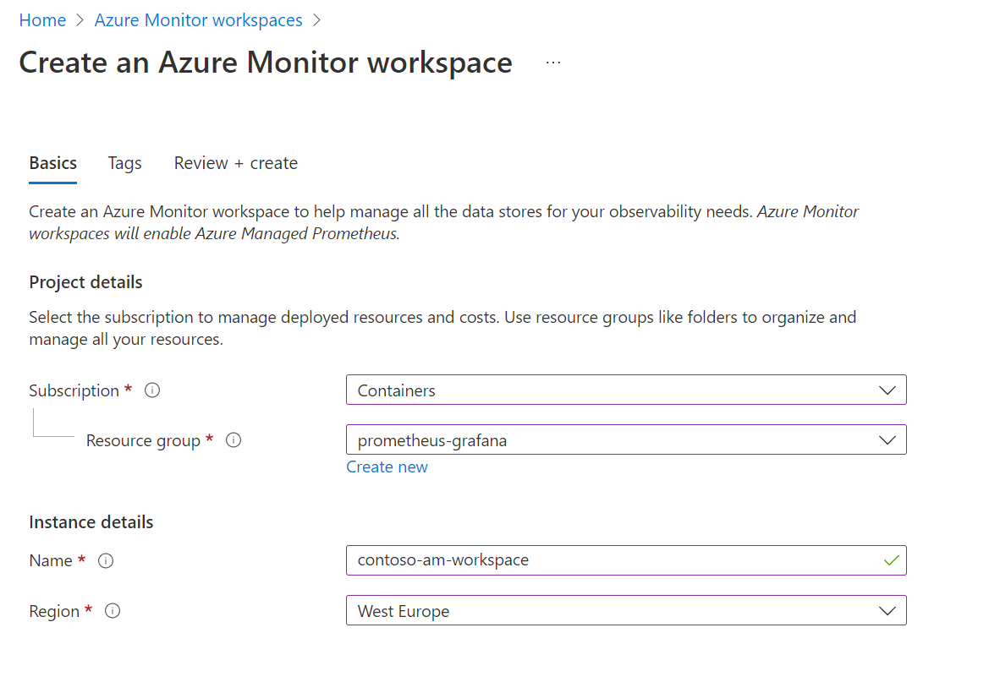
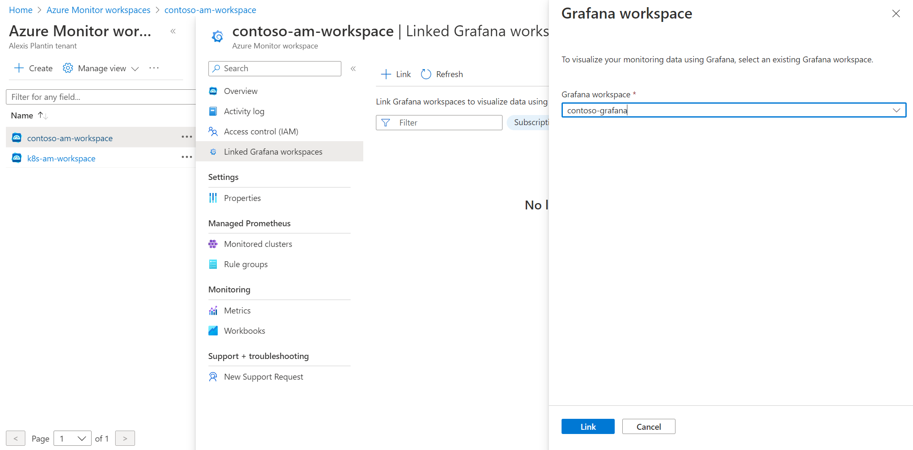
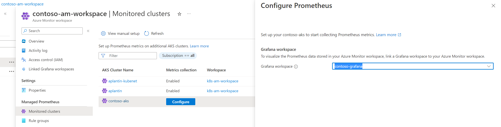
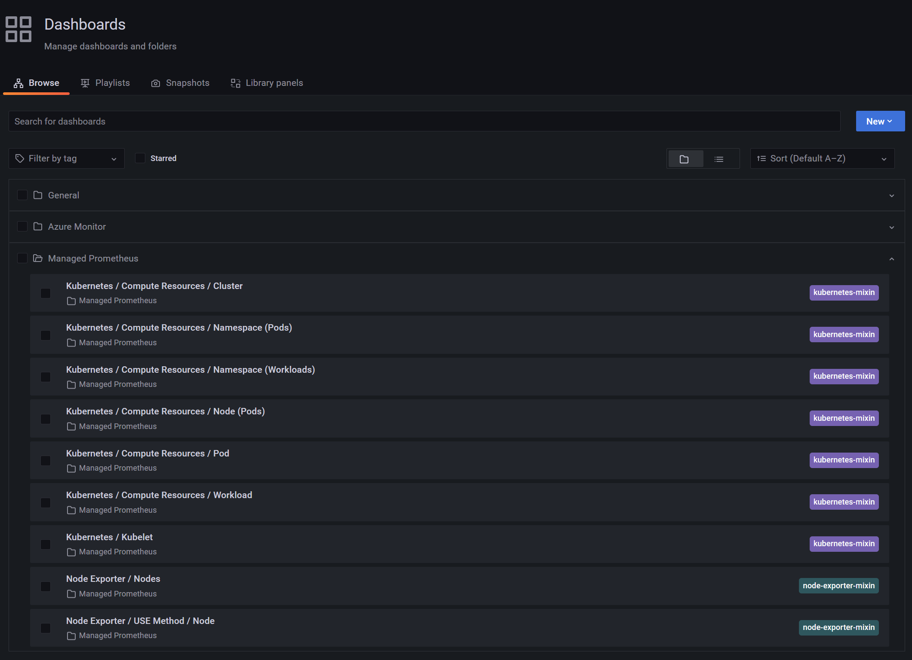
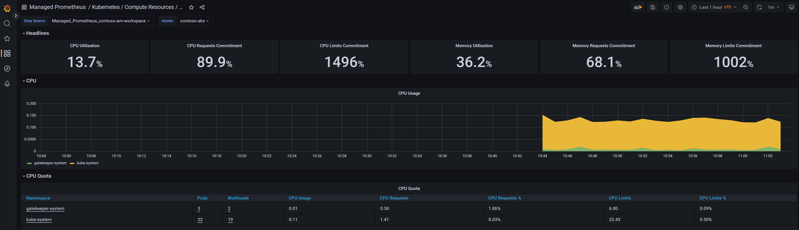

This article aims at describing how you can take benefit from the recent **Grafana** and **Prometheus** managed services to monitor your Kubernetes clusters in an easy and maintainable way

<section class="row">
  

  

    
  

  

</section>

General presentation of the services
====================================

Azure managed Grafana
---------------------

Azure managed Grafana lets you setup a complete Grafana instance fully managed in the Azure platform. It is a great service for people used to Grafana for years in other ecosystems because they can still rely on their well-known solution while jumping into the Azure world. This managed Grafana is highly available and comes with SLA guarantees (99.9%). It also provides automatic software updates and is seamlessly integrated with the Azure platform:

* **Automatic authentication and authorization setup** based on Azure AD identities and pre-built Azure roles (Grafana Admin, Grafana Editor and Grafana Viewer)
* capability to integrate **various Azure datasources** through an Azure managed identity and RBAC permissions on your subscriptions. By default, a fresh Grafana instance will get the Monitoring Reader role for all Azure Monitor data and Log Analytics resources on the subscription it has been created. Grants should be extended to other scopes then to collect more data from more data sources.
* default Grafana dashboards available as a base

Azure Monitor managed service for Prometheus
--------------------------------------------

Azure Monitor managed service for Prometheus is coming as a new feature in the Azure Monitor ecosystem and is interegrated in the Azure Monitor Metrics platform. It can be used to collect data from:
* AKS clusters through the automatic deployment of a special version of the Azure Monitor Agent (AMA)
* Any Kubernetes cluster with a Prometheus instance using the remote write feature

In this article, we will focus on the first option: integration of Prometheus and Grafana for an AKS cluster.

Setup your monitoring stack
===========================

Create your Azure Managed Grafana instance
------------------------------------------

Creating your Managed Grafana instance is as easy as providing it a name, a location and to explicitly say if you want or not your instance to be highly available through a deployment of VMs across multiple availability zones

<section class="row">
  

  

    
  

  

</section>

Other tabs cover more specific configurations:
* **Advanced**: here you could add advanced options like *Enabling API key creation* to perform some automation on your Grafana instance through API calls like creating dashboards and *Deterministic outbound IP* to get a fixed IP address for the outbound connectivity useful in many filtering scenarios
* **Permission**: this tab lets you customize default permission settings like disabling the Monitoring Reader on the target subscription or adding more Grafana administrator to the instance (only you as a default)

Once created, you can find your instance in the Azure portal and see on the overview your Grafana instance URL on the Endpoint section:

<section class="row">
  

  

    
  

  

</section>

When you hit this URL on your favorite Web browser, here you are! You will just get access to a traditional Grafana instance through SSO and if you already use Grafana, you shouldn't be lost

<section class="row">
  

  

    
  

  

</section>

The Azure integration part is visible when you go on the Dashboards screen where you will be able to find several pre-built dashboards to monitor your Azure resources:

<section class="row">
  

  

    
  

  

</section>

Pretty call to have our Grafana instance up & running but quite useless with no data in it, so let's jump to the next section

Create your Azure Monitor workspace
-----------------------------------

Now that we have our Grafana instance live, the next step is to setup our Azure Monitor workspace. But, what is an Azure Monitor workspace exactly? It is a preview service and to explain simply what it does, Azure Monitor workspace is for metrics what Log Analytics workspace is for logs. It means that customers will be able to create several worskpaces and decide which metrics to send to which workspaces. 
But, as of now, the service is pretty young and the only data that can be collected in an Azure Monitor workspace is Prometheus metrics. It does not really matter in our scenario as we precisely want to collect Prometheus metrics!

So, let's create it. Very straightforward, just give it a name and a location

<section class="row">
  

  

    
  

  

</section>

Link your Azure Monitor workspace to your Grafana instance
----------------------------------------------------------

Once your workspace is setup, go to the *Linked Grafana workspaces* menu to see the Grafana workspaces linked to your Azure Monitor workspace instance. Use the *Link* button to select your Grafana instance

<section class="row">
  

  

    
  

  

</section>

Enable Prometheus metrics collection
------------------------------------

Once your workspace is setup, go on the *Monitored clusters* menu to see the list of available clusters. Here you can see that some clusters on the screenshots are already connected to an existing workspace. We can now configure our contoso-aks cluster to use my new Azure Monitor workspace.

<section class="row">
  

  

    
  

  

</section>

The setup can take a couple of minutes.

Observe your clusters in Grafana
================================

Just like we have default dashboards to monitor Azure resources, we also have default dashboards for Kubernetes monitoring

<section class="row">
  

  

    
  

  

</section>

And you can see data in the different dashboards! 

<section class="row">
  

  

    
  

  

</section>

In a couple of minutes and with no effort, we have been able to setup a complete monitoring stack with Prometheus/Grafana. Of course, we let all default parameters and the next steps would be to go deeper in the monitoring solution to define metrics, thresholds, alerts...

References
==========

[Create a Grafana instance](https://learn.microsoft.com/en-us/azure/managed-grafana/quickstart-managed-grafana-portal)

[Create an Azure Monitor instance](https://learn.microsoft.com/en-us/azure/azure-monitor/essentials/azure-monitor-workspace-overview?tabs=azure-portal)

[Understanding metrics in Azure Monitor](https://learn.microsoft.com/en-us/azure/azure-monitor/essentials/data-platform-metrics)
