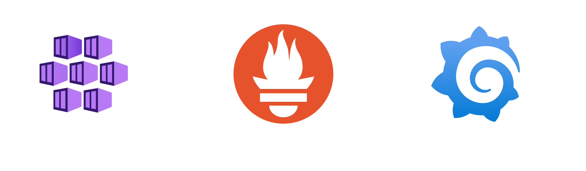
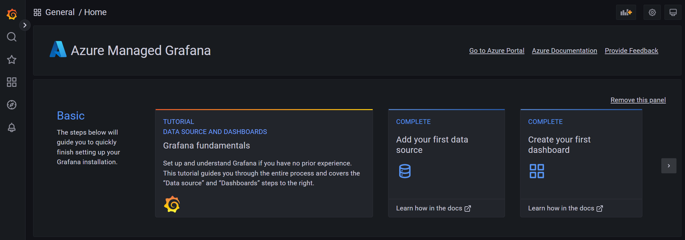
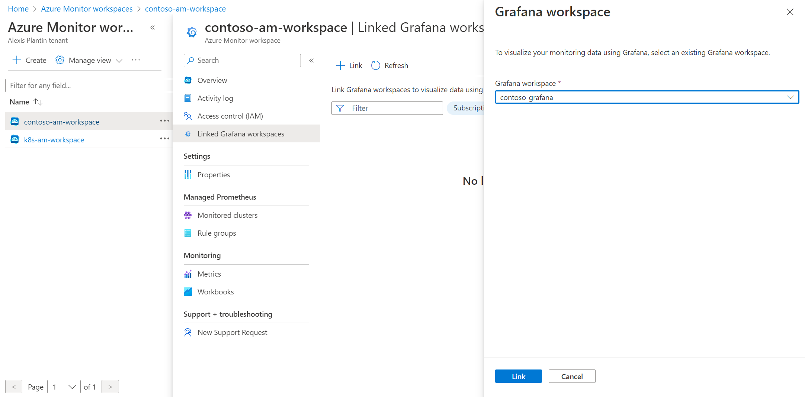
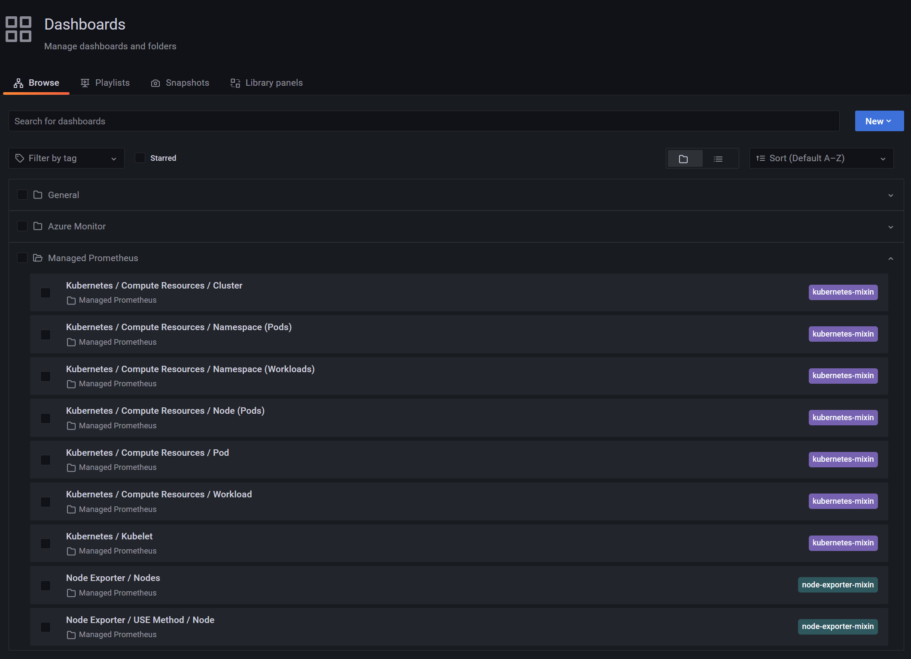

This article aims at describing how you can take benefit from the recent **Grafana** and **Prometheus** managed services to monitor your Kubernetes clusters in an easy and maintainable way

<section class="row">
  <div class="col-md-1"></div>
  <div class="col-md-10">
    
  </div>
  <div class="col-md-1"></div>
</section>

- [General presentation of the services](#general-presentation-of-the-services)
  - [Azure managed Grafana](#azure-managed-grafana)
  - [Azure Monitor managed service for Prometheus](#azure-monitor-managed-service-for-prometheus)
- [Setup your monitoring stack](#setup-your-monitoring-stack)
  - [Create your Azure Managed Grafana instance](#create-your-azure-managed-grafana-instance)
  - [Create your Azure Monitor workspace](#create-your-azure-monitor-workspace)
  - [Link your Azure Monitor workspace to your Grafana instance](#link-your-azure-monitor-workspace-to-your-grafana-instance)
  - [Enable Prometheus metrics collection](#enable-prometheus-metrics-collection)
- [Observe your clusters in Grafana](#observe-your-clusters-in-grafana)
- [Define alerts](#define-alerts)
  - [Prometheus rule groups](#prometheus-rule-groups)
  - [Action groups](#action-groups)
  - [Create the alerts](#create-the-alerts)
  - [Validate the workflow](#validate-the-workflow)
- [Prometheus/Grafana vs Containers Insights](#prometheusgrafana-vs-containers-insights)
- [Conclusion](#conclusion)
- [References](#references)


General presentation of the services
====================================

Azure managed Grafana
---------------------

Azure managed Grafana lets you set up a complete Grafana instance fully managed in the Azure platform and supported by Grafana Enterprise (enterprise plugins are not yet available). It is a great service for people used to Grafana for years in other ecosystems because they can still rely on their well-known solution while jumping into the Azure world. This managed Grafana is highly available and comes with SLA guarantees (99.9%). It also provides automatic software updates and is seamlessly integrated with the Azure platform:

* **Automatic authentication and authorization setup** based on Azure AD identities and pre-built Azure roles (Grafana Admin, Grafana Editor and Grafana Viewer)
* capability to integrate **various Azure data sources** through an Azure managed identity and RBAC permissions on your subscriptions. By default, a fresh Grafana instance will get the Monitoring Reader role for all Azure Monitor data and Log Analytics resources on the subscription it has been created. Grants should be extended to other scopes then to collect more data from more data sources.
* default Grafana dashboards available as a base

Azure Monitor managed service for Prometheus
--------------------------------------------

Azure Monitor managed service for Prometheus is coming as a new feature in the Azure Monitor ecosystem and is integrated into the Azure Monitor Metrics platform. It can be used to collect data from:
* AKS clusters through the automatic deployment of a special version of the Azure Monitor Agent (AMA)
* Any Kubernetes cluster with a self-managed Prometheus into the managed service using the remote write feature from Prometheus

In this article, we will focus on the first option: integration of Prometheus and Grafana for an AKS cluster.

Setup your monitoring stack
===========================

Create your Azure Managed Grafana instance
------------------------------------------

Creating your Managed Grafana instance is as easy as providing it a name, a location and explicitly say if you want or not your instance to be highly available through a deployment of VMs across multiple availability zones

<section class="row">
  <div class="col-md-1"></div>
  <div class="col-md-10">
    
  </div>
  <div class="col-md-1"></div>
</section>

Other tabs cover more specific configurations:
* **Advanced**: here you could add advanced options like *Enabling API key creation* to perform some automation on your Grafana instance through API calls like creating dashboards and *Deterministic outbound IP* to get a fixed IP address for the outbound connectivity useful in many filtering scenarios
* **Permission**: this tab lets you customize default permission settings like disabling the Monitoring Reader on the target subscription or adding more Grafana administrator to the instance (only you as a default)

Once created, you can find your instance in the Azure portal and see on the overview your Grafana instance URL in the Endpoint section:

<section class="row">
  <div class="col-md-1"></div>
  <div class="col-md-10">
    
  </div>
  <div class="col-md-1"></div>
</section>

When you hit this URL on your favorite Web browser, here you are! You will just get access to a traditional Grafana instance through SSO and if you already use Grafana, you shouldn't be lost

<section class="row">
  <div class="col-md-1"></div>
  <div class="col-md-10">
    
  </div>
  <div class="col-md-1"></div>
</section>

The Azure integration part is visible when you go to the Dashboards screen where you will be able to find several pre-built dashboards to monitor your Azure resources:

<section class="row">
  <div class="col-md-1"></div>
  <div class="col-md-10">
    
  </div>
  <div class="col-md-1"></div>
</section>

Pretty cool to have our Grafana instance up & running but quite useless with no data in it, so let's jump to the next section

Create your Azure Monitor workspace
-----------------------------------

Now that we have our Grafana instance live, the next step is to setup our Azure Monitor workspace. But, what is an Azure Monitor workspace exactly? It is a preview service and to explain simply what it does, Azure Monitor workspace is for metrics what Log Analytics workspace is for logs. It means that customers will be able to create several worskpaces and decide which metrics to send to which workspaces. 
But, as of now, the service is pretty young and the only data that can be collected in an Azure Monitor workspace is Prometheus metrics. It does not really matter in our scenario as we precisely want to collect Prometheus metrics!

So, let's create it. Very straightforward, just give it a name and a location

<section class="row">
  <div class="col-md-1"></div>
  <div class="col-md-10">
    
  </div>
  <div class="col-md-1"></div>
</section>

Link your Azure Monitor workspace to your Grafana instance
----------------------------------------------------------

Once your workspace is setup, go to the *Linked Grafana workspaces* menu to see the Grafana workspaces linked to your Azure Monitor workspace instance. Use the *Link* button to select your Grafana instance

<section class="row">
  <div class="col-md-1"></div>
  <div class="col-md-10">
    
  </div>
  <div class="col-md-1"></div>
</section>

Enable Prometheus metrics collection
------------------------------------

Once your workspace is setup, go to the *Monitored clusters* menu to see the list of available clusters. Here you can see that some clusters on the screenshots are already connected to an existing workspace. We can now configure our contoso-aks cluster to use my new Azure Monitor workspace.

<section class="row">
  <div class="col-md-1"></div>
  <div class="col-md-10">
    
  </div>
  <div class="col-md-1"></div>
</section>

The setup can take a couple of minutes.

Observe your clusters in Grafana
================================

Just like we have default dashboards to monitor Azure resources, we also have default dashboards for Kubernetes monitoring

<section class="row">
  <div class="col-md-1"></div>
  <div class="col-md-10">
    
  </div>
  <div class="col-md-1"></div>
</section>

And you can see data in the different dashboards! 

<section class="row">
  <div class="col-md-1"></div>
  <div class="col-md-10">
    
  </div>
  <div class="col-md-1"></div>
</section>

In a couple of minutes and with no effort, we have been able to setup a complete monitoring stack with Prometheus/Grafana. Of course, we let all default parameters and the next steps would be to go deeper in the monitoring solution to define metrics, thresholds, alerts...

Define alerts
=============

Prometheus rule groups
----------------------

Prometheus can be used to collect our metrics but it also comes with alerting capabilities. Let's see how it is structured and put some alerts in place.

In Azure Monitor workspace, you can define **Rule groups** that will contain rules which act on data collected by Prometheus. These rules can be of two different types:
- **Recording rule**: They are used to compute expressions and to store the results on custom time series. It is mainly useful for performance. By default, once our previous setup is done, you will see that 2 rules groups per cluster have been created in your Azure Monitor workspace. Each one contains a couple of recording rules. 
- **Alerts**: We can define our alerts, based on PromQL and integrate it directly in Azure Monitor to generate actions based on standard Azure Monitor actions groups


Action groups
-------------

As we just said before, we can act on Kubernetes alerts we defined with the complete portfolio of actions available in Azure Monitor actions groups. It means that we can of course send emails (this is what we'll do here) but also imagine more robust alerting scenarios like generating incidents in our favorite ITSM solution, run an Azure Function or a Logic App, call webhooks, send Teams messages...

<section class="row">
  <div class="col-md-1"></div>
  <div class="col-md-10">
    
  </div>
  <div class="col-md-1"></div>
</section>

Create the alerts
-----------------

As of now, the only way to define alerts on our Kubernetes cluster is to pass through ARM templates. In the [Azure documentation for Prometheus alert rules](https://learn.microsoft.com/en-us/azure/azure-monitor/containers/container-insights-metric-alerts?tabs=azure-portal#prometheus-alert-rules), you can find two rule groups samples with alert rules. We will just use the [**Community alerts**](https://github.com/Azure/prometheus-collector/blob/main/GeneratedMonitoringArtifacts/Default/DefaultAlerts.json) one. We can simply deploy the ARM template through the Azure portal

<section class="row">
  <div class="col-md-1"></div>
  <div class="col-md-10">
    
  </div>
  <div class="col-md-1"></div>
</section>

Here are the required ids to provide:
- **Action Group Resource Id**: The path to access your action group resource id is Azure Monitor > Alerts tab > Actions groups > [your action group] > Properties
- **Mac Resource Id**: This is the resource id of your Azure Monitor workspace 

Once created, alerts can be found in the Azure Monitor workspace > Rule groups

<section class="row">
  <div class="col-md-1"></div>
  <div class="col-md-10">
    
  </div>
  <div class="col-md-1"></div>
</section>

Validate the workflow
---------------------

Now, everything is ready and we can get alerts from Azure Monitor for our Kubernetes clusters. To validate it, I just try to create a simple pod with more memory than what's available on my nodes and it will set the pod in a **Pending** status

```
apiVersion: v1
kind: Pod
metadata:
  name: pending-sample-app
spec:
  containers:
    - image: gcr.io/kuar-demo/kuard-amd64:1
      name: kuard
      livenessProbe:
        httpGet:
          path: /healthy
          port: 8080
        initialDelaySeconds: 5
        timeoutSeconds: 1
        periodSeconds: 10
        failureThreshold: 3
      ports:
        - containerPort: 8181
          name: http
          protocol: TCP
      resources:
        requests:
          memory: "8Gi"
          cpu: "250m"
        limits:
          memory: "8Gi"
          cpu: "500m"
```

After 5 minutes (which is the time defined in the alert definition), the alert is fired and I receive the expected email

<section class="row">
  <div class="col-md-1"></div>
  <div class="col-md-10">
    
  </div>
  <div class="col-md-1"></div>
</section>

Prometheus/Grafana vs Containers Insights
=========================================

In this article, we have seen how to setup a Prometheus/Grafana stack using Azure managed services to monitor our Kubernetes clusters and these services are quite new (Prometheus is still in preview). But you may know that there is also another native monitoring capability called Containers Insights which give you lots of features around Kubernetes clusters observability. 

Actually, Containers Insights is not only metrics oriented as it also collects logs and send them into a Log Analytics workspace. For the metrics part, Container Insights now propose 2 options:
- send the data to either Azure Monitor Logs through the monitoring addon
- send the data to Azure Monitor managed service for Prometheus through the metrics addon

So the Prometheus part can be been as a subpart of the global Container Insights solution, even if it can be used independently.

Grafana is not part of Container Insights and overlaps with Azure Monitor Workbooks feature as a visualization solution. Both can be used in parallel and which one to use is more of a personal preference.

Conclusion
==========

For people used to manage Prometheus/Grafana stack for a long time, it is very straightforward to continue to use it in Azure with the managed services. It is even easier that before because you don't need to manage the infrastructure to make sure your services are up & running. You can instead focus on what really matters:
- which data should I collect?
- what are my alerts?
- what should be the workflow for which kind of alerts?

References
==========

[Create a Grafana instance](https://learn.microsoft.com/en-us/azure/managed-grafana/quickstart-managed-grafana-portal)

[Create an Azure Monitor instance](https://learn.microsoft.com/en-us/azure/azure-monitor/essentials/azure-monitor-workspace-overview?tabs=azure-portal)

[Understanding metrics in Azure Monitor](https://learn.microsoft.com/en-us/azure/azure-monitor/essentials/data-platform-metrics)

[Azure Monitor workspace - Rule groups](https://learn.microsoft.com/en-us/azure/azure-monitor/essentials/prometheus-rule-groups)