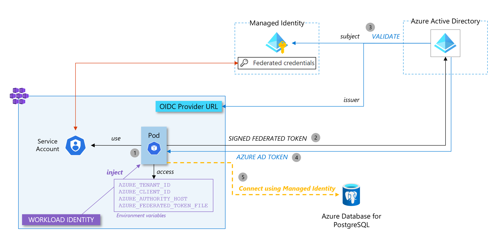

This article aims at explaining, with a detailed example the workload identity federation feature. It enables pods from any Kubernetes cluster distribution to use a federation mechanism with an Azure Managed identity which allows, in the end, scenarios where the workload can interact with Azure resources relying on identities instead of passwords.

To illustrate the feature, we will setup a complete example with a simple Spring Boot application that will connect to an Azure database for PostgreSQL in a passwordless model.

- [A bit of theory](#a-bit-of-theory)
  - [What is a managed identity?](#what-is-a-managed-identity)
  - [Workload identity federation](#workload-identity-federation)
  - [Federated credentials](#federated-credentials)
  - [Workload identity in Kubernetes](#workload-identity-in-kubernetes)
- [Let's make it!](#lets-make-it)
  - [TL;DR](#tldr)
  - [Prerequisite: A well configured AKS cluster](#prerequisite-a-well-configured-aks-cluster)
  - [Managed identity](#managed-identity)
  - [PostgreSQL database](#postgresql-database)
  - [Namespace \& Service account](#namespace--service-account)
  - [Federated credentials](#federated-credentials-1)
  - [Our Spring Boot application](#our-spring-boot-application)
    - [pom.xml](#pomxml)
    - [application.properties](#applicationproperties)
  - [The last piece: our application deployed in the cluster](#the-last-piece-our-application-deployed-in-the-cluster)
  - [Verification](#verification)
- [From any Kubernetes distribution, really?](#from-any-kubernetes-distribution-really)
- [Conclusion](#conclusion)
- [References](#references)


A bit of theory
===============

What is a managed identity?
---------------------------

[A managed identity](https://learn.microsoft.com/en-us/azure/active-directory/managed-identities-azure-resources/overview) in Azure is a type of service principal that allows an application or service to authenticate with other Azure services securely, without the need for storing credentials. Credentials are not accessible and a managed identity gets an access token from Azure AD instead. Services use these tokens to access Azure services that support Azure AD authentication.

Workload identity federation
----------------------------

We have just seen that, for workloads hosted in Azure, we can use a managed identity to authenticate against Azure AD protected resources (such as a KeyVault or a database) without the need to manage credentials. It is a great way to improve security (no credentials leakage) and operability (no credentials expiration that could compromise your application availability) but it was not available, by default, to workloads hosted outside of Azure. 

Workload identity federation minds the gap by using standard federation mechanisms where we can establish trusted connectivity between an external identity provider (IdP) and Azure AD which acts as the service provider. Workloads use tokens issued by their IdP to exchange it with a valid Azure AD access token (through a managed identity) and then use this token to access Azure services.

Federated credentials
---------------------

Now that we have explained the concept of workload identity federation, federated credentials in Azure is the way to establish this trust relationship between the external IdP and an Azure AD managed application (a managed identity). It is part of the configuration within a user-assigned managed identity. It contains several fields but the most important ones are 
- issuer: this is the URL which corresponds to the IdP. It is used by Azure AD to get keys and control that tokens it receives have been provided by this IdP.
- subject: this is the identifier of the workload coming from the external system

When a request token is received from a workload, issuer and subject contained in the token are checked against the ones provided in the federated credentials configuration. Then, Azure AD will be able to move forward in the workflow of delivering an access token.

Workload identity in Kubernetes
-------------------------------

Now that we have defined all the concepts above (managed identity, workload identity federation and federated credentials), we can put all the pieces together to explain how we can achieve our goal: having a pod (our application) in a Kubernetes cluster that will get an access token to connect to our database instead of credentials.


Let's make it!
==============

TL;DR
-----

A gist which goes through all steps is available [here](https://gist.github.com/alexisP/88222ce7a6ed6188e726186f4b763e23)

Prerequisite: A well configured AKS cluster
--------------------------------------------

To perform this tutorial, you need an AKS cluster with two features enabled: workload-identity and oidc-issuer.

```
export RESOURCE_GROUP="<YOUR-RESOURCE-GROUP>"
export CLUSTER_NAME="<YOUR-CLUSTER-NAME>"
export LOCATION="westeurope"    
```

Here is a command to create a compliant cluster:

```
az group create --location $LOCATION --name $RESOURCE_GROUP
az aks create -g ${RESOURCE_GROUP} -n ${CLUSTER_NAME} --enable-oidc-issuer --enable-workload-identity
```

Here is a command to add the features to an existing cluster

```
az aks update -g ${RESOURCE_GROUP} -n ${CLUSTER_NAME} --enable-oidc-issuer --enable-workload-identity
```

Once we have the cluster created (or updated), we must get its OIDC issuer URL:

```
export AKS_OIDC_ISSUER="$(az aks show -n "${CLUSTER_NAME}" -g "${RESOURCE_GROUP}" --query "oidcIssuerProfile.issuerUrl" -otsv)"
```

Now, we have a Kubernetes cluster with an IODC issuer. This means that when a workload (a pod) asks for an access token to Azure AD (AAD), AAD will validate the signed token before exchanging it with an AAD access token.

<section class="row">
  <div class="col-md-1"></div>
  <div class="col-md-10">
    
  </div>
  <div class="col-md-1"></div>
</section>

Managed identity
----------------

Now, let's create our managed identity (a user assigned managed identity)

```
export SUBSCRIPTION="$(az account show --query id --output tsv)"
export USER_ASSIGNED_IDENTITY_NAME="passswordless-demo-identity"   

# Create a managed identity and get its client id
az identity create \
    --name "${USER_ASSIGNED_IDENTITY_NAME}" \
    --resource-group "${RESOURCE_GROUP}" \
    --location "${LOCATION}" \
    --subscription "${SUBSCRIPTION}"

export USER_ASSIGNED_CLIENT_ID="$(az identity show --resource-group "${RESOURCE_GROUP}" --name "${USER_ASSIGNED_IDENTITY_NAME}" --query 'clientId' -otsv)"
```

<section class="row">
  <div class="col-md-1"></div>
  <div class="col-md-10">
    
  </div>
  <div class="col-md-1"></div>
</section>

PostgreSQL database
-------------------

Now, let's create the database (an Azure Database for PostgreSQL - Single Server) and configure it. Once the PostgreSQL server is created, here is what should be configured for our demo:
- Create a database instance for our future application
- Add a firewall rule to our server to enable public communication (consider using [Private Endpoint](https://learn.microsoft.com/en-us/azure/postgresql/single-server/concepts-data-access-and-security-private-link) in production!)
- Create an AAD admin for the server (adding an AAD admin is required because it is the mechanism that activates AAD authentication on the server that we will use for our managed identity authentication)
- Create a PostgreSQL user associated with our managed identity

```
export DATABASE_NAME="<YOUR-DATABASE-SERVER-NAME>"
export DATABASE_LOCAL_USER="<A-LOCAL-USERNAME>"
export DATABASE_PASSWORD="<A-SUPER-SECURED-PASSWORD>"

echo "Creating PostgreSQL Server instance"

az postgres server create \
    --resource-group $RESOURCE_GROUP \
    --name $DATABASE_NAME \
    --location $LOCATION \
    --sku-name B_Gen5_1 \
    --storage-size 5120 \
    --admin-user $DATABASE_LOCAL_USER \
    --admin-password $DATABASE_PASSWORD \
   -o tsv

echo "-----------------------------------------------------"
echo "Configuring PostgreSQL Server firewall"

az postgres server firewall-rule create \
    --resource-group $RESOURCE_GROUP \
    --name $DATABASE_NAME-database-allow-local-ip \
    --server $DATABASE_NAME \
    --start-ip-address 0.0.0.0 \
    --end-ip-address 255.255.255.255 \
   -o tsv

echo "-----------------------------------------------------"
echo "Configuring PostgreSQL Server database"

az postgres db create \
    --resource-group $RESOURCE_GROUP \
    --name demo \
    --server-name $DATABASE_NAME \
   -o tsv


# Put yourself as an AAD admin
echo "-----------------------------------------------------"
echo "Add yourself as an Azure AD Admin"

export DATABASE_AAD_ADMIN_OBJECT_ID=$(az ad signed-in-user show --query "[id]" -o tsv)
export DATABASE_AAD_ADMIN_NAME=$(az ad signed-in-user show --query "[mail]" -o tsv)
az postgres server ad-admin create \
    --server-name $DATABASE_NAME \
    -g $RESOURCE_GROUP \
    --display-name $DATABASE_AAD_ADMIN_NAME \
    --object-id $DATABASE_AAD_ADMIN_OBJECT_ID
```

You should now be in a situation where you have your Azure database for PostgreSQL instance ready and configured. The next step is to create the local user in PostgreSQL that corresponds to the managed identity (Note that you need the client ID of the managed identity created in the previous section).

```
export DATABASE_APPLICATION_USER=myuser@$DATABASE_NAME
export PGPASSWORD=$(az account get-access-token --resource-type oss-rdbms --query "[accessToken]" -o tsv)
psql "host=$DATABASE_NAME.postgres.database.azure.com port=5432 dbname=demo user=<YOUR-AAD-ALIAS>@$DATABASE_NAME sslmode=require"
```

Now, you should be connected to the PostgreSQL server with `psql`, you need to type the following command to create the association between a local PostgreSQL role and your managed identity:

```
SET aad_validate_oids_in_tenant = off;
CREATE ROLE myuser WITH LOGIN PASSWORD '<MANAGED_IDENTITY_CLIENT_ID>' IN ROLE azure_ad_user;
GRANT ALL PRIVILEGES ON DATABASE demo TO "myuser";
```

The PostgreSQL database is now ready for a passwordless connection with the managed identity.

<section class="row">
  <div class="col-md-1"></div>
  <div class="col-md-10">
    
  </div>
  <div class="col-md-1"></div>
</section>


Namespace & Service account
---------------------------

Now, let's jump into the Kubernetes cluster to deploy a fresh new namespace and a service account associated with our managed identity (still through its client ID).

```
export NAMESPACE_NAME="<YOUR-SERVICE-ACCOUNT-NAMESPACE>"
export SERVICE_ACCOUNT_NAME="<YOUR-SERVICE-ACCOUNT-NAME>"

az aks get-credentials --resource-group $RESOURCE_GROUP --name $CLUSTER_NAME

# Create a namespace and the service account
kubectl create namespace "${NAMESPACE_NAME}"

# Create the service account
cat <<EOF | kubectl apply -f -
apiVersion: v1
kind: ServiceAccount
metadata:
  annotations:
    azure.workload.identity/client-id: ${USER_ASSIGNED_CLIENT_ID}
  labels:
    azure.workload.identity/use: "true"
  name: ${SERVICE_ACCOUNT_NAME}
  namespace: ${NAMESPACE_NAME}
EOF
```

The magic starts to operate here. When we enabled the *workload-identity* feature on our cluster, we actually configured a mutating webhook that will inject variables and files directly into the pod ecosystem as soon as this pod is using the newly created service account as its service account (don't worry, we will see how to do it in the last section when we will deploy the application).

<section class="row">
  <div class="col-md-1"></div>
  <div class="col-md-10">
    
  </div>
  <div class="col-md-1"></div>
</section>

Federated credentials
---------------------

As explained in the theorical section at the beginning of this article, the federation mechanism between an external workload and a user assigned managed identity is done by creating these federated credentials in the managed identity with the issuer and the subject that respectively match the OIDC provider URL of the Kubernetes cluster and the unique identifier of the workload in the cluster

```
export FEDERATED_IDENTITY_CREDENTIAL_NAME="my-fed-identity-cred"

# Create the fererated credential
az identity federated-credential create \
    --name ${FEDERATED_IDENTITY_CREDENTIAL_NAME} \
    --identity-name ${USER_ASSIGNED_IDENTITY_NAME} \
    --resource-group ${RESOURCE_GROUP} \
    --issuer ${AKS_OIDC_ISSUER} \
    --subject system:serviceaccount:${NAMESPACE_NAME}:${SERVICE_ACCOUNT_NAME}
```

Now, all the pieces are in place and the magic can happen.

<section class="row">
  <div class="col-md-1"></div>
  <div class="col-md-10">
    
  </div>
  <div class="col-md-1"></div>
</section>

Our Spring Boot application
---------------------------

For the Spring Boot application, I used the one issued from the sample from Azure-Samples on GitHub (https://github.com/Azure-Samples/quickstart-spring-data-jpa-postgresql) which illustrates how to make a Spring Boot application connected to an Azure database for PostgreSQL and I adapted its configuration to make it compatible with a passordless authentication through a managed identity. To adapt this application, you need to modify two elements:

### pom.xml

You need to add a dependency management and a dependency block as shown in the example below:

```
    <properties>
		...
	</properties>

	<dependencyManagement>
		<dependencies>
			<dependency>
			<groupId>com.azure.spring</groupId>
			<artifactId>spring-cloud-azure-dependencies</artifactId>
			<version>4.7.0</version>
			<type>pom</type>
			<scope>import</scope>
			</dependency>
		</dependencies>
	</dependencyManagement>

	<dependencies>
		...
		<dependency>
			<groupId>com.azure.spring</groupId>
			<artifactId>spring-cloud-azure-starter-jdbc-postgresql</artifactId>
		</dependency>

		...
	</dependencies>
```

### application.properties

Then, we just need to change the datasource configuration in the `application.properties` to explicitly say that we'll use the passwordless (managed identity) authentication mechanism. 

You need to:
- remove the password property
- add the passwordless-enabled property set to true
- variabilize the username for more flexibility

The final result looks like

```
logging.level.org.hibernate.SQL=DEBUG

spring.datasource.url=jdbc:postgresql://${AZ_DATABASE_NAME}.postgres.database.azure.com:5432/demo
spring.datasource.username=${AZ_DATABASE_USER}
spring.datasource.azure.passwordless-enabled=true

spring.jpa.show-sql=true
spring.jpa.hibernate.ddl-auto=create-drop
```

I will not go through the details of how the applications has been built, packaged and deployed in this article. Feel free to go to this [Github repository](https://github.com/alexisP/spring-boot-demo/tree/passwordless) for more information (last part of the README file). We will assume for the rest of the article that this application is available as a Docker image at the following URL: `aplantin.azurecr.io/spring-boot/spring-boot-demo-workload-identity-passwordless:1.2`

The last piece: our application deployed in the cluster
-------------------------------------------------------

The application, for the simplicity of the example, is deployed as a simple pod, as you can see in the snippet below. Here are the important things to notice in the pod specification:
- it may seem obvious, but it must be deployed in the same namespace as the service account we created previously
- it must have the following label `azure.workload.identity/use: "true"` to explicitly say that our pod will have environment variables injected by the workload-identity mutating webhook
- it must contain two environment variables named AZ_DATABASE_NAME and AZ_DATABASE_USER, as they are referenced and used in the application.properties file

```
# Deploy the app
cat <<EOF | kubectl apply -f -
apiVersion: v1
kind: Pod
metadata:
  name: spring-boot-demo-workload-identity-passwordless
  namespace: ${NAMESPACE_NAME}
  labels:
    azure.workload.identity/use: "true"
spec:
  serviceAccountName: ${SERVICE_ACCOUNT_NAME}
  containers:
    - image: aplantin.azurecr.io/spring-boot/spring-boot-demo-workload-identity-passwordless:1.2
      name: spring-boot-demo-workload-identity-passwordless
      env:
      - name: AZ_DATABASE_NAME
        value: ${DATABASE_NAME}
      - name: AZ_DATABASE_USER
        value: ${DATABASE_APPLICATION_USER}
EOF
```

<section class="row">
  <div class="col-md-1"></div>
  <div class="col-md-10">
    
  </div>
  <div class="col-md-1"></div>
</section>

1. Our pod uses the service account and - as the property workload.identity/use is set to true - has environment variables injected into its local FS. When the pod is created, the mutating webhook, which is part of the workload identity feature we activated on our cluster, projects a signed service account token to our workload's volume and injects 4 environment variables to the pod (`AZURE_AUTHORITY_HOST`, `AZURE_CLIENT_ID`, `AZURE_TENANT_ID` and `AZURE_FEDERATED_TOKEN_FILE`) to pod.
2. The signed federated token (which contains the issuer and the subject in its payload) is sent to Azure AD to get access to an Azure AD access token
3. Azure AD will verify the federated token by getting the public key to control the signature of the federated token
4. Once it has validated the federated token, Azure AD sends a valid access token
5. The application uses the access token to authenticate to the database

Verification
------------

You can check the pod logs to see that everything is going well at startup time

```
kubectl logs -f spring-boot-demo-workload-identity-passwordless -n $NAMESPACE_NAME
```

You should see an output similar to this one which shows that the managed identity authentication has been used and that the connectivity to the database is well established:

```
2023-05-04 15:20:44.218  INFO 1 --- [           main] AbstractAzureServiceClientBuilderFactory : Will configure the default credential of type DefaultAzureCredential for class com.azure.identity.DefaultAzureCredentialBuilder.
2023-05-04 15:20:44.220  INFO 1 --- [onnection adder] c.a.i.e.i.t.AccessTokenResolverOptions   : Ossrdbms scope set to https://ossrdbms-aad.database.windows.net/.default.
2023-05-04 15:20:44.222  INFO 1 --- [onnection adder] c.azure.identity.ChainedTokenCredential  : Azure Identity => Attempted credential EnvironmentCredential is unavailable.
2023-05-04 15:20:44.231  INFO 1 --- [      Thread-11] c.m.a.msal4j.AcquireTokenSilentSupplier  : Returning token from cache
2023-05-04 15:20:44.232  INFO 1 --- [      Thread-11] c.a.identity.ManagedIdentityCredential   : Azure Identity => Managed Identity environment: AZURE AKS TOKEN EXCHANGE
2023-05-04 15:20:44.233  INFO 1 --- [      Thread-11] c.a.identity.ManagedIdentityCredential   : Azure Identity => getToken() result for scopes [https://ossrdbms-aad.database.windows.net/.default]: SUCCESS
2023-05-04 15:20:44.234  INFO 1 --- [      Thread-11] c.azure.identity.ChainedTokenCredential  : Azure Identity => Attempted credential ManagedIdentityCredential returns a token
2023-05-04 15:20:44.404  INFO 1 --- [           main] o.s.b.w.embedded.tomcat.TomcatWebServer  : Tomcat started on port(s): 8080 (http) with context path ''
2023-05-04 15:20:44.417  INFO 1 --- [           main] com.example.demo.DemoApplication         : Started DemoApplication in 10.552 seconds (JVM running for 11.461)
2023-05-04 15:20:44.453 DEBUG 1 --- [           main] org.hibernate.SQL                        : select nextval ('hibernate_sequence')
Hibernate: select nextval ('hibernate_sequence')
2023-05-04 15:20:44.487 DEBUG 1 --- [           main] org.hibernate.SQL                        : select nextval ('hibernate_sequence')
Hibernate: select nextval ('hibernate_sequence')
2023-05-04 15:20:44.491 DEBUG 1 --- [           main] org.hibernate.SQL                        : select nextval ('hibernate_sequence')
Hibernate: select nextval ('hibernate_sequence')
2023-05-04 15:20:44.511 DEBUG 1 --- [           main] org.hibernate.SQL                        : insert into todo (description, details, done, id) values (?, ?, ?, ?)
Hibernate: insert into todo (description, details, done, id) values (?, ?, ?, ?)
2023-05-04 15:20:44.584 DEBUG 1 --- [           main] org.hibernate.SQL                        : insert into todo (description, details, done, id) values (?, ?, ?, ?)
Hibernate: insert into todo (description, details, done, id) values (?, ?, ?, ?)
2023-05-04 15:20:44.589 DEBUG 1 --- [           main] org.hibernate.SQL                        : insert into todo (description, details, done, id) values (?, ?, ?, ?)
Hibernate: insert into todo (description, details, done, id) values (?, ?, ?, ?)
com.example.demo.Todo@1f
com.example.demo.Todo@1f
com.example.demo.Todo@1f
```

You can also reach the application by running a port forward command:

```
kubectl port-forward spring-boot-demo-workload-identity-passwordless 8080:8080 -n $NAMESPACE_NAME
```

Jump to your brower at localhost:8080 to see your application with data
<section class="row">
  <div class="col-md-1"></div>
  <div class="col-md-10">
    
  </div>
  <div class="col-md-1"></div>
</section>

You could also use psql to check directly in the database.

Yes, we did it! We have our Spring Boot application deployed in a Kubernetes cluster which connects to an Azure database for PostgreSQL without any credentials stored anywhere.

From any Kubernetes distribution, really?
=========================================

Of course, things are easier to setup in AKS as the requirements (an OIDC issuer configured with the cluster and Azure AD workload identity which injects federated credentials into pods) can be added to a cluster by just providing the two flags `--enable-oidc-issuer` and `--enable-workload-identity`, but let's see if we can have our Spring Boot application running in an EKS (on AWS) cluster and if we are still able to connect to our database in a passwordless model.

Let's consider that you have an EKS cluster up & running in AWS. By default, you already have an OpenID provider setup and associated with the cluster. As you can see on the screenshot below, you can get the URL from the Overview tab. As a reminder, this URL is used to setup the federated credential.

<section class="row">
  <div class="col-md-1"></div>
  <div class="col-md-10">
    
  </div>
  <div class="col-md-1"></div>
</section>

Then, we need to install Azure AD workload identity in our EKS cluster. First, put your context to your EKS cluster. Then, it is straightforward

```
export AZURE_TENANT_ID="<YOUR-TENANT-ID>"

helm repo add azure-workload-identity https://azure.github.io/azure-workload-identity/charts
helm repo update
helm install workload-identity-webhook azure-workload-identity/workload-identity-webhook \
   --namespace azure-workload-identity-system \
   --create-namespace \
   --set azureTenantID="${AZURE_TENANT_ID}"
```

The cluster is now ready! We just need to
- create the service account
- create a new federated credential to match with our new OICD issuer
- deploy the exact same pod we did before on AKS

```
export RESOURCE_GROUP="<YOUR-RESOURCE-GROUP>"
export CLUSTER_NAME="<YOUR-CLUSTER-NAME>"
export USER_ASSIGNED_IDENTITY_NAME="<YOUR-USER_ASSIGNED_IDENTITY_NAME>"    
export FEDERATED_IDENTITY_CREDENTIAL_NAME="eks-fererated-credentials"
export SERVICE_ACCOUNT_NAMESPACE="<YOUR-SERVICE-ACCOUNT-NAMESPACE>"
export SERVICE_ACCOUNT_NAME="<YOUR-SERVICE-ACCOUNT-NAME>"
export DATABASE_NAME="<YOUR-DATABASE-SERVER-NAME>"
export DATABASE_USER="<A-LOCAL-USERNAME>"
export DATABASE_APPLICATION_USER=myuser@$DATABASE_NAME

# Copy/paste the value we found in the Overview tab of our EKS cluster in the screenshot above
export EKS_OIDC_ISSUER="<EKS_OIDC_URL>"

# Create a namespace and the service account
kubectl create namespace "${SERVICE_ACCOUNT_NAMESPACE}"

# Create the service account
cat <<EOF | kubectl apply -f -
apiVersion: v1
kind: ServiceAccount
metadata:
  annotations:
    azure.workload.identity/client-id: ${USER_ASSIGNED_CLIENT_ID}
  labels:
    azure.workload.identity/use: "true"
  name: ${SERVICE_ACCOUNT_NAME}
  namespace: ${SERVICE_ACCOUNT_NAMESPACE}
EOF

# Create the fererated credential
az identity federated-credential create \
    --name ${FEDERATED_IDENTITY_CREDENTIAL_NAME} 
    --identity-name ${USER_ASSIGNED_IDENTITY_NAME} 
    --resource-group ${RESOURCE_GROUP} 
    --issuer ${EKS_OIDC_ISSUER} 
    --subject system:serviceaccount:${SERVICE_ACCOUNT_NAMESPACE}:${SERVICE_ACCOUNT_NAME}

# Deploy the app
cat <<EOF | kubectl apply -f -
apiVersion: v1
kind: Pod
metadata:
  name: spring-boot-demo-workload-identity-passwordless
  namespace: ${SERVICE_ACCOUNT_NAMESPACE}
  labels:
    azure.workload.identity/use: "true"
spec:
  serviceAccountName: ${SERVICE_ACCOUNT_NAME}
  containers:
    - image: aplantin.azurecr.io/spring-boot/spring-boot-demo-workload-identity-passwordless:1.2
      name: spring-boot-demo-workload-identity-passwordless
      env:
      - name: AZ_DATABASE_NAME
        value: ${DATABASE_NAME}
      - name: AZ_DATABASE_USER
        value: ${DATABASE_APPLICATION_USER}
EOF
```

We can verify that our application works as expected:

```
kubectl port-forward spring-boot-demo-workload-identity-passwordless 8080:8080
```

Jump to your browser at localhost:8080 to see your application with data
<section class="row">
  <div class="col-md-1"></div>
  <div class="col-md-10">
    
  </div>
  <div class="col-md-1"></div>
</section>

We now have our Spring Boot application deployed in EKS that connects to its Azure Database for PostgreSQL using a passwordless authentication mechanism!

# Conclusion

As we demonstrated, once the Kubernetes cluster is well configured (with an OIDC provider and the workload identity mutating webhook in place), it is pretty straightforward to setup a passwordless authentication to Azure services which support Azure AD authentication. The example here connects to an Azure database for PostgreSQL but the same priciples can be used for other services like a storage account or a KeyVault.

The feature is free, as part of the managed identity service, and give you a great way to get secured authentication while getting rid of all operational aspects (such as rotating credentials) as it is fully managed under the hood by Microsoft.


References
==========

* [Workload identity overview](https://learn.microsoft.com/en-us/azure/aks/workload-identity-overview)
* [Workload identity federation](https://learn.microsoft.com/en-us/azure/active-directory/workload-identities/workload-identity-federation)
* [Azure AD Workload identity](https://azure.github.io/azure-workload-identity/docs/quick-start.html)
* [OIDC on AKS](https://learn.microsoft.com/en-us/azure/aks/use-oidc-issuer)
* [Workload identity on AKS](https://learn.microsoft.com/en-us/azure/aks/workload-identity-deploy-cluster)
* [Sample for Spring Boot application](https://github.com/alexisP/spring-boot-demo/tree/passwordless) - cloned from [Azure samples - Spring Boot application](https://github.com/Azure-Samples/quickstart-spring-data-jpa-postgresql)
* [Spring configuration for passwordless authentication](https://learn.microsoft.com/en-us/azure/developer/java/spring-framework/migrate-postgresql-to-passwordless-connection?tabs=sign-in-azure-cli%2Cjava%2Capp-service%2Cassign-role-service-connector)
* [Configure AD authentication with PostgreSQL](https://learn.microsoft.com/en-us/azure/postgresql/single-server/how-to-configure-sign-in-azure-ad-authentication)
* [PostgreSQL authentication with managed identity](https://learn.microsoft.com/en-us/azure/postgresql/single-server/how-to-connect-with-managed-identity)
* [A great article about workload identity federation](https://device-insight.com/en/developers-blog/use-azure-ad-workload-identity-for-pod-assigned-managed-identity-in-aks/)