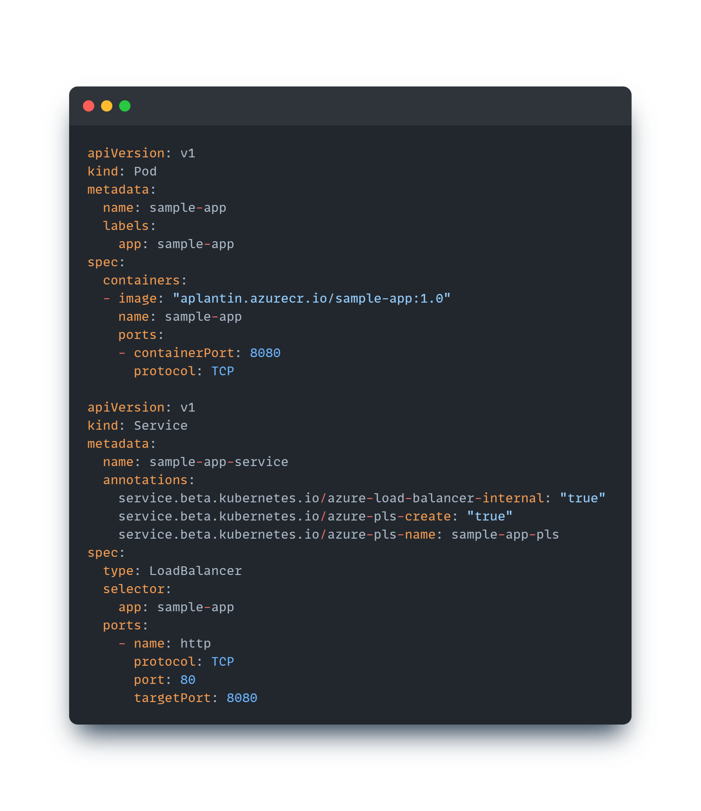

This article aims at demonstrating with a quick example how easy it is to expose an AKS application to consumers outside of your organisation through the usage of Private Link Service and its new integration in AKS. Note that it was already possible to configure a Private Link Service by yourself on top of a Standard Load Balancer generated by AKS but it was not really integrated and you had to do some extra work by yourself. Now, exposing a service through Private Link Service in AKS is a matter of a couple of annotations only! 

What is a private endpoint?
---------------------------

In Azure, a private endpoint can be assimilated to a network interface that you deploy on your own virtual network and which points to a remote service hosted on the Azure platform. It is one of the standard and most used way to establish private connectivity to Azure PaaS services (Storage accounts, SQL Databases, Redis caches...). It is available on mostly all Azure services nowadays but it could also be used to point to other services hosted in Azure outside through the usage of Private Link Service.

What is Private Link Service?
-------------------------------

Private Link Service is a mechanism that let you propose to your customers or partners to consume your own services hosted on your virtual networks through private endpoints created on their private virtual networks. This exposition is possible as soon as the service is accessible through a Standard Load Balancer. Here is a schema (from Azure documentation) which illustrate the principle

<section class="row">
  

  

    
  

  

</section>

As we can see in the schema above, as soon as the application is exposed behind a Standard Load Balancer:
- you create a Private Link Service instance on top of the Standard Load Balancer
- you communicate to organizations you would like to allow communication with the Private Link Service resourceId or alias
- they create the private endpoint associated to your Private Link Service
- You approve the private endpoint connection (there are also possibilities around visibility of your private link service and auto approval but this is out of scope for this article).

More information can be found on Microsoft official documentations:
- [Private endpoints](https://learn.microsoft.com/en-us/azure/private-link/private-endpoint-overview)
- [Private Link Service](https://learn.microsoft.com/en-us/azure/private-link/private-link-service-overview)

AKS and Private Link service integration
----------------------------------------

To expose applications and services outside of an AKS cluster, several options are available:
- Ingress controllers (internal and external)
- Application Gateways using AGIC or a modern way through the new Application Gateway for Containers
- directly through Load Balancers (one again, these LBs could be private or public)

We will focus on the last option and especially on exposing our applications through a private load balancer, then exposed with a Private Link Service. Here is basically what we would like to setup.

<section class="row">
  

  

    
  

  

</section>

To implement it, Microsoft recently released a new AKS feature called Private Link Service integration. 

### Expose our application to internal networks

As you probably know, to create a load balancer exposition from within an AKS cluster, we simply need to create a Service object of type LoadBalancer and AKS automatically create the appropriate load balancer and load balancing rules. To illustrate it, here is a Pod and a Service associated to this pod:

<section class="row">
  

  

    
  

  

</section>

Our sample-app application is now available from outside the AKS cluster (but only on connected Vnets as we defined our load balancer as internal. No external customers or partners outside of my tenant can access it yet).

<section class="row">
  

  

    
  

  

</section>

### Expose our application privately through Private Link Service integration

#### Application is unreachable from other non connected networks

Now, let's try to reach the same application but from a spoke which is not connected to our AKS cluster (it is even in another tenant). As expected, we cannot reach the application as no network links are in place.

<section class="row">
  

  

    
  

  

</section>

#### Annotate our Service

To make our application available through Private Link Service, it is now as easy as annotating our Service with specific annotations. So, let's annotate our existing Service to make it exposable and consumable through a Private Link Service.

<section class="row">
  

  

    
  

  

</section>

After a couple of minutes, the setup is complete and we can find our Private Link service and an associated NIC within the AKS managed resource group (as a reminder this resource group can be found on the **Properties** tab of your AKS cluster). We then need to get the resourceId of the Private link service which is required for the next step.

<section class="row">
  

  

    
  

  

</section>

#### Create the Private endpoint

On tenant b, we will now create a private endpoint pointing to our Private link service to make our private connectivity to our service live. We reference the resourceId we got from the previous step and we define our Vnet and subnet where our private endpoint will stand.

<section class="row">
  

  

    
  

  

</section>

<section class="row">
  

  

    
  

  

</section>

Once created, the private will be in a Pending connection state because the Private Link service owner needs to validate it.

#### Approve the private endpoint connection

On the Private Link service instance side, we can see that we now have a private endpoint connection waiting for our approval, so we just approve it to authorize our customer/partner to reach our service privately through a private endpoint on his network.

<section class="row">
  

  

    
  

  

</section>

#### Verify the connection

Now, on tenant b, the private endpoint connection status is approved and we can get the private ip of the NIC as shown in the screenshot below 

<section class="row">
  

  

    
  

  

</section>

Let's try to curl our service from a VM hosted in the tenant b spoke01 Vnet

<section class="row">
  

  

    
  

  

</section>

It works perfectly fine!

As demonstrated in this article, from a service provider point of view, it is really easy now to expose a service privately to consumers or partners using this Private Link Service integration. We made a really simple and short demonstration but if you want to dig more on it, much more options are available on the service (TCP proxy support, FQDNs...) and here is the link to the documentation: [Private Link Service integration](https://cloud-provider-azure.sigs.k8s.io/topics/pls-integration/)